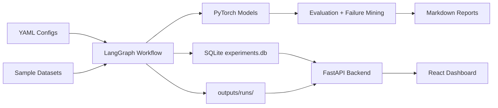
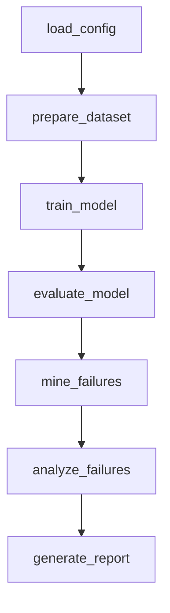
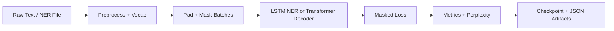
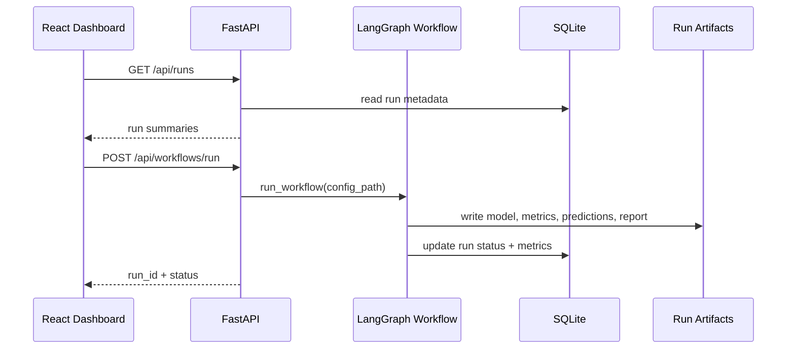

# Agentic AI Model Evaluation & Training Workflow System

An AI Engineering portfolio project that combines PyTorch model training, LangGraph workflow orchestration, FastAPI experiment tracking, and a React dashboard for model evaluation.

## One-Line Summary

This project trains LSTM NER and Transformer Decoder models, evaluates them through an agentic LangGraph workflow, mines failure cases, generates reports, tracks runs in SQLite, and exposes everything through a FastAPI + React dashboard.

## Why This Is An AI Engineering Project

This is not a simple LangChain demo. It demonstrates the engineering pieces behind a practical model evaluation system:

- **Under-the-hood ML:** PyTorch models, tokenization, padding, masking-aware loss, causal attention masking, checkpointing, and configurable training loops.
- **Agentic orchestration:** LangGraph coordinates dataset preparation, training, evaluation, failure mining, failure analysis, and report generation through explicit workflow state.
- **Experiment tracking:** FastAPI + SQLite store run metadata and expose run artifacts for dashboards and tooling.
- **Product surface:** React + TypeScript frontend lets users trigger workflows, inspect metrics, review predictions, read reports, and explain results visually.

## System Architecture



## LangGraph Workflow



The same workflow supports both `task: ner` and `task: language_modeling`. The config decides which dataset builder, model, trainer, evaluator, and report details are used.

## Model Training Pipeline



## Frontend / Backend Interaction



## Supported Models

| Model | Task | Key implementation details |
| --- | --- | --- |
| LSTM NER | Sequence tagging | `nn.Embedding`, `nn.LSTM`, linear token classifier, padding mask, token accuracy |
| Transformer Decoder | Next-token prediction | manual positional encoding, scaled dot-product attention, multi-head attention, causal mask, feed-forward blocks |

Restrictions intentionally followed:

- No Hugging Face for core model implementation.
- No `nn.Transformer`.
- No `nn.TransformerDecoder`.
- No `nn.MultiheadAttention`.

## Backend API

Start the API:

```bash
uvicorn src.api.main:app --reload
```

Endpoints:

```text
GET  /api/health
GET  /api/runs
GET  /api/runs/{run_id}
GET  /api/runs/{run_id}/metrics
GET  /api/runs/{run_id}/predictions
GET  /api/runs/{run_id}/failures
GET  /api/runs/{run_id}/report
POST /api/workflows/run
```

Example workflow trigger:

```bash
curl -X POST http://127.0.0.1:8000/api/workflows/run \
  -H "Content-Type: application/json" \
  -d '{"config_path": "configs/transformer_workflow.yaml"}'
```

## Frontend Dashboard

The React dashboard supports:

- run listing and filtering
- run detail pages
- metric cards
- predictions viewer
- failure case viewer
- report viewer
- workflow launch form for NER and Transformer runs

Start the dashboard:

```bash
cd frontend
npm install
npm run dev
```

Open:

```text
http://localhost:5173
```

## Setup

```bash
python3 -m venv .venv
source .venv/bin/activate
pip install -r requirements.txt

cd frontend
npm install
cd ..
```

## Run Instructions

Run LSTM NER workflow:

```bash
python3 run_workflow.py --config configs/ner_workflow.yaml
```

Run Transformer Decoder workflow:

```bash
python3 run_workflow.py --config configs/transformer_workflow.yaml
```

Run backend:

```bash
uvicorn src.api.main:app --reload
```

Run frontend:

```bash
cd frontend
npm run dev
```

Run NER prediction from a checkpoint:

```bash
python3 predict.py \
  --checkpoint outputs/runs/<run_id>/model.pt \
  --sentence "Tesla builds vehicles in California"
```

Run Transformer generation from a checkpoint:

```bash
python3 predict.py \
  --task transformer \
  --checkpoint outputs/runs/<run_id>/model.pt \
  --prompt "machine learning"
```

## Test Instructions

Run Python tests:

```bash
python3 -m pytest
```

Run frontend build:

```bash
cd frontend
npm run build
```

Run both with Make:

```bash
make test
```

## Sample Screenshots

Screenshots are placeholders for GitHub README presentation. Add real images after running the dashboard locally.

```text
docs/assets/dashboard.png
docs/assets/run-detail.png
docs/assets/new-run.png
```

Suggested captures:

- Dashboard showing recent NER and Transformer runs.
- Run detail page with metrics, predictions, failures, and report tabs.
- New Run page showing workflow selection cards.

## Sample Outputs

Safe sample artifacts are included:

```text
outputs/sample_metrics.json
outputs/sample_predictions.jsonl
outputs/sample_report.md
```

Example metrics:

```json
{
  "eval_loss": 0.0029,
  "perplexity": 1.003,
  "loss_history": [
    { "epoch": 1, "loss": 3.12 },
    { "epoch": 2, "loss": 1.84 },
    { "epoch": 3, "loss": 0.72 }
  ]
}
```

Example generated text:

```text
machine learning models predict tokens machine learning
```

## Resume Bullets

**Agentic AI Model Evaluation & Training Workflow System**

- Built a LangGraph-powered AI workflow that automates dataset preparation, PyTorch model training, evaluation, failure analysis, and human-in-the-loop review.
- Implemented LSTM NER and Transformer Decoder models with masking-aware loss, causal attention masking, checkpointing, and configurable training pipelines.
- Developed a FastAPI and React dashboard to track experiment runs, visualize metrics, inspect predictions, review failure cases, and read generated improvement reports.
- Added SQLite experiment tracking, LLM-based failure analysis, Markdown report generation, and unit tests for attention masks, tensor shapes, metrics, APIs, and workflow state transitions.

## Documentation

Additional docs:

- [Architecture](docs/architecture.md)
- [Workflow](docs/workflow.md)
- [API](docs/api.md)
- [Interview Notes](docs/interview_notes.md)

## Project Structure

```text
configs/                  Workflow YAML configs
data/                     Sample datasets
docs/                     Architecture and interview documentation
frontend/                 React + TypeScript dashboard
src/api/                  FastAPI backend
src/data/                 Dataset builders and preprocessing
src/db/                   SQLite repository
src/evaluation/           Evaluator, failure miner, report generator
src/llm/                  Failure analyzer wrapper
src/models/               LSTM NER and Transformer Decoder
src/training/             Losses, metrics, trainers
src/workflow/             LangGraph state, graph, nodes
tests/                    Pytest suite
```
