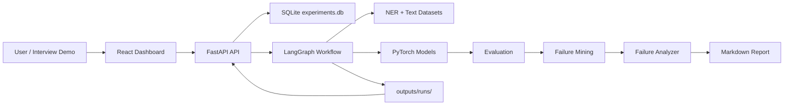

# Architecture

## Overall System



## Main Responsibilities

- `frontend/`: visual dashboard for running workflows and inspecting artifacts.
- `src/api/`: FastAPI routes for runs, metrics, predictions, failures, reports, and workflow triggers.
- `src/db/`: SQLite schema and repository helpers.
- `src/workflow/`: workflow state, graph construction, and node functions.
- `src/models/`: PyTorch model implementations.
- `src/evaluation/`: metrics, predictions, failure cases, and report generation.

## Data Flow

1. User selects a workflow config.
2. FastAPI calls `run_workflow(config_path)`.
3. LangGraph executes workflow nodes in order.
4. Training artifacts are written under `outputs/runs/<run_id>/`.
5. SQLite tracks run metadata and metrics.
6. React dashboard reads run data through FastAPI.

## Experiment Artifacts

Each run writes:

```text
outputs/runs/<run_id>/model.pt
outputs/runs/<run_id>/metrics.json
outputs/runs/<run_id>/predictions.jsonl
outputs/runs/<run_id>/failure_cases.jsonl
outputs/runs/<run_id>/report.md
```
