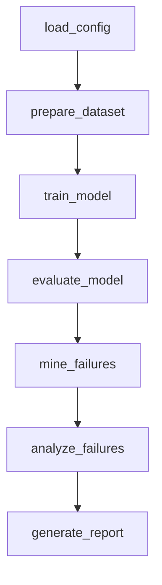
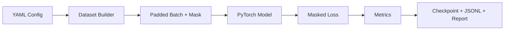

# Workflow

## LangGraph Nodes



## Workflow State

The workflow passes a shared state dictionary through every node. Important fields include:

- `config_path`
- `config`
- `run_id`
- `run_dir`
- `dataset`
- `model`
- `batch`
- `training_history`
- `metrics`
- `predictions`
- `failure_cases`
- `failure_analysis`
- `report_path`
- `completed_nodes`

## Task Branching

The workflow supports two task types:

```yaml
task: ner
model_type: lstm_ner
```

```yaml
task: language_modeling
model_type: transformer_decoder
```

The `prepare_dataset`, `train_model`, and `evaluate_model` nodes branch based on `task`.

## Model Training Pipeline



## Failure Analysis

For NER runs, `mine_failures` compares gold tags with predicted tags and writes token-level errors to `failure_cases.jsonl`.

For language modeling runs, failure cases are empty for now. The report focuses on loss, perplexity, and generated text.
